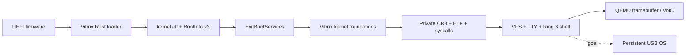

<div align="center">

# ◇ VIBRIX

### A Rust-native operating system designed to live on your USB drive.

**Independent kernel · persistent by design · built by AI agents**

`x86_64` · `UEFI` · `Rust` · `no_std` · `QEMU/OVMF` · `0BSD`

> **How far can vibe coding go?**  
> A compiled Rust shell now runs in Ring 3, with real syscalls and a bounded RAM filesystem.

[**Website**](https://mixutin.github.io/Vibrix/) · [Verified status](https://mixutin.github.io/Vibrix/status/) · [Roadmap](ROADMAP.md) · [Security roadmap](SECURITY_ROADMAP.md) · [Architecture](docs/ARCHITECTURE.md) · [Dependencies](docs/DEPENDENCIES.md) · [Contributing](CONTRIBUTING.md)

[](https://github.com/mixutin/Vibrix/actions/workflows/ci.yml)
[](https://github.com/mixutin/Vibrix/actions/workflows/userspace-display.yml)
[](https://github.com/mixutin/Vibrix/actions/workflows/dependencies.yml)
[](https://mixutin.github.io/Vibrix/)
[](LICENSE)
[](https://www.rust-lang.org/)

</div>

## What is Vibrix?

Vibrix is an experimental **independent Unix-like operating system** written in Rust, not a Linux distribution or a wrapper around another kernel. Its defining product goal is simple:

> **The removable USB drive is the computer.**

The intended bootloader, kernel, userspace, applications, settings and home directory travel together on one persistent removable drive. Hardware is rediscovered at boot. Internal NVMe/SATA drives may eventually be optional data devices, never Vibrix system/root installation targets.

**That persistent USB operating system is not available yet.** The established QEMU result includes a standalone kernel, bounded Ring 3 ELF execution, real syscalls, an interactive Rust shell and core utilities on a volatile bootstrap filesystem. A mounted persistent USB root, general multi-process environment and physical-machine qualification remain unfinished.

## Current status — 29 September 2026

The M5/M6 baseline includes merged [shell runtime #176](https://github.com/mixutin/Vibrix/pull/176) and [core utilities #180](https://github.com/mixutin/Vibrix/pull/180). Consult the [roadmap](ROADMAP.md) for exact-head evidence and the deliberately bounded meaning of each completed item.

| Area | Scope and boundary |
| --- | --- |
| UEFI → standalone kernel | QEMU firmware exit, higher-half kernel and BootInfo v3 |
| CPU/memory foundations | CPUID, GDT/TSS, IDT/fault diagnostics, physical frames, early heap, bounded managed map/protect/reclaim, guarded regions and real CPU fault evidence |
| Discovery / PCI interrupts | ACPI, PCI/BAR + MCFG/ECAM, driver binding, CPU inventory and native interrupt evidence; see the roadmap for individual hardware/probe limits |
| Driver binding | Fixed-capacity ownership registry; binding is not hardware activation |
| Timer and scheduling | Native IRQ delivery and bounded kernel-thread/preemption evidence; not a general user-process scheduler |
| M5 userspace | Private CR3, Ring 3, ELF loading, ABI/wrappers, real SYSCALL/SYSRETQ and bounded PID/wait/exit behavior |
| M6 shell and files | Real `vibrix-sh`, `/dev/tty`, descriptors, bootstrap VFS and core utilities; RAM-only, minimal process/job control |
| Interactive display | The launcher selects the userspace profile and mirrors its TTY to GOP pixels; the dedicated display workflow verifies automatic boot and real VNC input against screenshots |
| Legacy kernel console | Retained explicitly with `--kernel-console`; distinct `vibrix>` diagnostic prompt |
| Native USB persistence / Target 001 | Not demonstrated by these userspace/QEMU milestones |

### Real userspace, not a renamed kernel console

The shell is a compiled `no_std` userspace ELF. It reads fd 0 and writes fd 1/2 through the native syscall path and the VFS TTY. Its command set is:

```text
help    echo    cat    ls    pwd    cd    mkdir    cp    mv    rm    ps    kill    exit
```

The bounded utilities have real VFS/process backends. This does not imply external program spawning, shell pipelines/redirection, full signals/job control, atomic rename, recursive copy or POSIX conformance. Bootstrap files disappear at reboot.

The graphical frontend displays the actual shell's `vibrix$` output, echoes accepted keyboard input, and handles a cursor, wrapping, Backspace and scrolling. It is a small ASCII software terminal, not a graphical desktop or an ANSI/Unicode terminal emulator. The established PS/2 decoder remains a limited unshifted input subset. Serial/debug logging is retained independently. See [userspace display](docs/USERSPACE_DISPLAY.md) for safety, input and testing boundaries.

The earlier M4.5 kernel development console is still useful for diagnostics, but is no longer the ordinary interactive launcher's default. Its `vibrix>` prompt and commands such as `mem`, `pci`, `acpi`, `uptime` and `reboot` are not the Ring 3 shell.

## Boot path and next steps



The architecture remains Rust-native: a Vibrix-owned UEFI loader and kernel, native subsystem contracts, Rust userspace, driver work, VibrixFS integration and removable-root provisioning. SMP coordination, broader process scheduling, operational hardware coverage and persistent system integration remain separate milestones. See [architecture](docs/ARCHITECTURE.md), [roadmap](ROADMAP.md) and [security roadmap](SECURITY_ROADMAP.md).

## Try the development build

Install Git, the Rust toolchain manager, QEMU and OVMF, then:

```bash
git clone https://github.com/mixutin/Vibrix.git
cd Vibrix
./tools/run-qemu.sh
```

The interactive launcher builds the userspace profile automatically. Click the QEMU window to type at `vibrix$`. For the same screen through a VNC viewer:

```bash
./tools/run-qemu.sh --vnc
```

Connect to **127.0.0.1:5900**. `--vnc=1` uses port 5901. VNC is localhost-only, unauthenticated and unencrypted; use an authenticated SSH tunnel for remote access rather than exposing it publicly. This is not a bundled browser/noVNC service.

To restore the diagnostic kernel console:

```bash
./tools/run-qemu.sh --kernel-console
```

An explicit `VIBRIX_KERNEL_FEATURES` override takes precedence over the usual interactive default. The direct builder and original headless test retain their diagnostic defaults for regression coverage:

```bash
./tools/test-qemu.sh
python3 tools/test_userspace_display.py
```

The second test exercises the actual automatic launcher, sends real VNC keys and checks captured guest pixels for the prompt, editing and command results. Its workflow retains screenshots/logs. Consult exact-head Actions results rather than treating the presence of a test as passing evidence.

The build uses the repository-pinned toolchain and Cargo.lock. Follow [QEMU.md](docs/QEMU.md) for prerequisites, firmware discovery, input and logs. Do not run multiple launchers in the same checkout concurrently. Do not treat this workflow as permission to flash an internal disk or as proof of physical-machine support.

## Rust-native, not reinvent-everything-native

**Community crates and external development tools are welcome.** Agents may use crates.io packages, reviewed Git dependencies and properly licensed vendored Rust libraries when they make Vibrix safer, simpler or more maintainable. Dependencies need not use 0BSD themselves; their own licenses and notices remain applicable.

Admission includes research into provenance, maintenance, advisories, transitive features, unsafe code, build scripts/procedural macros, native linkage and actual-target compatibility. Git crates use a full commit revision and an explicitly reviewed repository entry. An unfamiliar source/license needs a scoped policy decision, not a blanket library ban or a global scanner bypass.

The loader must work on `x86_64-unknown-uefi`; the kernel on `x86_64-unknown-none`. Do not silently introduce a host OS, unavailable allocator, `std` or a C runtime into those components. Using a published crate API under its license is permitted; copying another OS's implementation into Vibrix-owned code is not. Read [dependency policy](docs/DEPENDENCIES.md) and [independence policy](docs/INDEPENDENCE.md).

## CI that checks the inputs as well as the kernel

The workflow uses a committed Cargo.lock and locked builds, a dated Rust nightly, RustSec/cargo-deny audits, PR dependency review and minimal-feature checks on both targets. Reports expose licenses, sources, dependency/feature graphs and build-time code indicators. Workflow linting and immutable Action references complement production host tests and real QEMU probes.

The userspace display workflow adds framebuffer bounds/editing/scrolling host tests, real VNC keyboard input and screenshot pixel assertions. It does not replace canonical formatting, Clippy, dependency or existing fault/IRQ/probe checks. Website checks cover links/fragments, structured data, metadata and browser helpers; PRs do not deploy. A passing scanner is not a security guarantee or a whole-system SBOM.

The aggregate `CI gate`, separate `Website checks` and applicable feature evidence must pass before integration. **Repository branch-protection settings must enforce required checks; adding workflow YAML alone does not prevent a failing PR from being merged.** See [CI.md](docs/CI.md) for coverage, artifacts and limits.

## AI-only engineering, evidence first

AI agents implement, test and document the system while the owner sets direction. Substantive changes require primary-source research, comparison of reasonable approaches, actual test evidence and honest limits. PR titles and descriptions credit the known authoring model; independent review is named only when it happened.

Coordinate through current PRs and repository state, not archived boards. Read [AGENTS.md](AGENTS.md), [coordination](AGENT_COORDINATION.md) and the [AI contribution guide](docs/AI_CONTRIBUTING.md). Synchronize with current main and repair failing checks before integration. A single active agent can integrate a bounded passing change under the standing maintainer policy; that never waives safety or evidence.

**Compiled is not boot-tested. QEMU-tested is not bare-metal tested. Generated code is not a completed feature.**

## License

First-party Vibrix code is available under the **BSD Zero Clause License (0BSD)**; see [LICENSE](LICENSE). External dependencies retain their own licenses and attribution requirements.

<div align="center">

### ◇ VIBRIX

**Small enough to understand. Ambitious enough to become an OS.**

</div>
