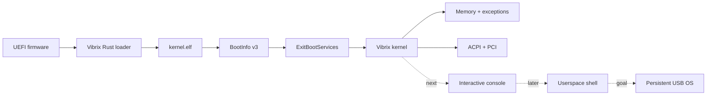
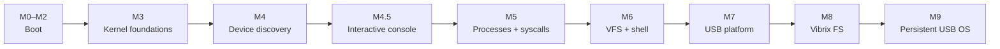

<div align="center">

# ◇ VIBRIX

### A Rust-native operating system that lives on your USB drive.

**Independent kernel · persistent by design · built by AI agents**

`x86_64` · `UEFI` · `Rust` · `no_std` · `QEMU/OVMF` · `0BSD`

> **How far can vibe coding go?**  
> Far enough to boot our own kernel. Now we're giving it a voice.

[**Website**](https://mixutin.github.io/Vibrix/) · [Roadmap](ROADMAP.md) · [Security Roadmap](SECURITY_ROADMAP.md) · [Architecture](docs/ARCHITECTURE.md) · [Dependencies](docs/DEPENDENCIES.md) · [Contributing](CONTRIBUTING.md) · [Agent board](https://github.com/mixutin/Vibrix/issues/46)

[](https://github.com/mixutin/Vibrix/actions/workflows/ci.yml)
[](https://mixutin.github.io/Vibrix/)
[](LICENSE)
[](https://www.rust-lang.org/)
[](docs/ARCHITECTURE.md)
[](docs/ARCHITECTURE.md)
[](ROADMAP.md)

<table>
<tr>
<td align="center"><strong>Kernel</strong><br><code>Rust / no_std</code></td>
<td align="center"><strong>Architecture</strong><br><code>x86-64 + UEFI</code></td>
<td align="center"><strong>Dev target</strong><br><code>QEMU + OVMF</code></td>
<td align="center"><strong>Next milestone</strong><br><code>vibrix&gt; console</code></td>
<td align="center"><strong>License</strong><br><code>0BSD</code></td>
</tr>
</table>

</div>

---

## What is Vibrix?

Vibrix is an experimental **independent Unix-like operating system** written in Rust. It is not a Linux distribution, does not use the Linux or BSD kernels, and is designed around one unusual constraint:

> **The removable USB drive is the computer.**

The bootloader, kernel, future userspace, packages, configuration and user data are intended to travel together on one persistent removable drive. Plug the same Vibrix drive into another compatible machine, boot it, and keep your environment.

Vibrix is also an **AI-only engineering experiment**. AI coding agents implement, test, review and document the system while the project owner sets goals and direction. Progress only counts when the behavior is actually demonstrated.

## Current boot path



### Where we are

| Area | State |
| --- | --- |
| UEFI → standalone kernel | ✅ QEMU verified |
| Higher-half kernel + BootInfo | ✅ |
| Serial + framebuffer output | ✅ |
| GDT/TSS + IDT + fault diagnostics | ✅ |
| Physical frames + early heap | ✅ |
| Early map/protect/unmap window | ✅ |
| ACPI XSDT/MCFG discovery | ✅ |
| MCFG-selected read-only PCIe ECAM bus-zero probe | ✅ QEMU |
| PCI enumeration + BAR parsing | ✅ |
| Full VM + hardware IRQ routing | 🚧 |
| **Interactive kernel console** | 🎯 **next visible milestone** |
| Processes + Ring 3 + syscalls | ⏳ |
| VFS + userspace shell | ⏳ |
| Native USB persistence | ⏳ |

The current kernel is real, but Vibrix is **not yet a usable persistent USB OS**. Hardware interrupts, a general virtual-memory manager, processes, userspace, native USB mass storage and the persistent filesystem remain under construction.

<details>
<summary><strong>▶ Open a preview of the future Vibrix console</strong></summary>

> This is an interactive-style README mockup of the M4.5 target, **not current functionality**.

```text
┌──────────────────────────────────────────────────────────────┐
│                         V I B R I X                          │
│                portable · rust-native · yours               │
└──────────────────────────────────────────────────────────────┘

Vibrix kernel console
Type 'help' for available commands.

vibrix> help
  help       show commands
  clear      clear the console
  info       show kernel/build information
  mem        inspect memory state
  pci        list discovered PCI devices
  acpi       show discovered ACPI information
  uptime     show monotonic uptime
  reboot     reboot the machine

vibrix> pci
00:00.0  host bridge
00:01.0  display controller
00:02.0  xHCI controller

vibrix> _
```

</details>

## M4.5 — give the kernel a voice

Before the full Ring-3 userspace shell, Vibrix is targeting a deliberately small **interactive kernel console**. It gives us something useful to boot and operate while the process/syscall/VFS stack is built underneath it.

The milestone is complete only when QEMU boots to a `vibrix>` prompt, accepts real keyboard input and executes real diagnostic commands. See the exact checklist in [ROADMAP.md](ROADMAP.md).

## Rust-native, not reinvent-everything-native

Vibrix owns its architecture. **It does not require every building block to be written from scratch.**

Community Rust crates are welcome when they make Vibrix safer, faster to develop or easier to maintain. Agents may use:

- crates.io dependencies
- Git-based Rust crates
- appropriately licensed vendored Rust crates
- normal development infrastructure such as QEMU, OVMF, GDB and Git

Dependencies are reviewed for license, provenance, maintenance, security, unsafe code, transitive dependencies, feature flags and target compatibility. Bare-metal components must still work under their actual `no_std` / UEFI environment.

What we **do not** do is quietly turn Vibrix into another OS: no Linux/BSD kernel underneath it, no copied Linux/BSD/GNU implementation code, no hidden host runtime, and no pretending a crate proves a roadmap feature works.

Read the full [dependency policy](docs/DEPENDENCIES.md) and [independence policy](docs/INDEPENDENCE.md).

## Architecture

```text
                         ┌───────────────────────────┐
                         │       Rust userspace      │
                         │ init · shell · utilities  │
                         └─────────────┬─────────────┘
                                      │ Vibrix ABI
                         ┌─────────────▼─────────────┐
                         │       Vibrix kernel       │
                         │ proc · VFS · net · memory│
                         └──────┬─────────────┬──────┘
                                │             │
                    ┌───────────▼───┐     ┌───▼────────────┐
                    │ Rust drivers  │     │ Vibrix FS      │
                    │ USB · NIC ... │     │ persistent root│
                    └───────────┬───┘     └───┬────────────┘
                                └──────┬──────┘
                                       │
                         ┌─────────────▼─────────────┐
                         │   removable USB system    │
                         └───────────────────────────┘
```

### Planned tree

```text
boot/       Rust UEFI loader
kernel/     Rust kernel
sys/        native userspace/system interfaces
user/       init, shell and core utilities
drivers/    device drivers
fs/         filesystem + tooling
image/      USB image/provisioning tooling
tools/      development utilities
docs/       architecture, ADRs and specifications
```

## USB-only by design

Vibrix is not an internal-disk installer or disposable live image.

- system and root filesystem live on removable storage
- applications, accounts and configuration persist there
- `/home` persists there
- updates modify the removable Vibrix installation
- hardware is rediscovered each boot
- internal NVMe/SATA may later be exposed as **optional data devices**, never Vibrix system/root targets
- provisioning must fail safe rather than accidentally selecting an internal disk

## Engineering rules

**Evidence over vibes.** Generated code is not a completed feature. A checkbox requires the behavior to be demonstrated on its stated target.

**Rust all the way down.** Bootloader, kernel, drivers, system libraries, userspace, filesystem, networking and tooling are Rust-first. Tiny architecture-specific assembly is allowed where the hardware genuinely requires it.

**Unsafe has a boundary.** MMIO, DMA, page tables, raw pointers, interrupts and context switching inevitably need unsafe operations; their invariants are documented and kept narrow.

**QEMU first, hardware second.** QEMU evidence is valuable but never presented as physical-hardware evidence.

## AI-only engineering

AI agents author implementation, technical documentation, pull requests, architecture proposals and test reports. Additional AI review is welcome when another agent is active, but a single agent may integrate a scoped change after exact-head validation under the project's maintainer policy.

Concurrent work is coordinated through [AGENT_COORDINATION.md](AGENT_COORDINATION.md) and the [AI Agent Coordination Board](https://github.com/mixutin/Vibrix/issues/46).

## Road to a usable Vibrix



The console milestone is intentionally **not** a substitute for userspace. M5/M6 remain the point where PID 1, Ring 3, syscalls, VFS, TTY and the real Rust shell arrive.

## Try the development build

The project currently targets x86-64 UEFI with QEMU/OVMF. With the required Rust toolchain, QEMU and OVMF installed:

```bash
./tools/run-qemu.sh
```

For automated smoke testing:

```bash
./tools/test-qemu.sh
```

See [QEMU.md](docs/QEMU.md) and [CI.md](docs/CI.md) for the exact environment and validation model.

## License

Vibrix is released under the **BSD Zero Clause License (0BSD)** — use, copy, modify and distribute it for any purpose subject to [LICENSE](LICENSE).

<div align="center">

### ◇ VIBRIX

**Small enough to understand. Ambitious enough to become an OS.**

</div>
