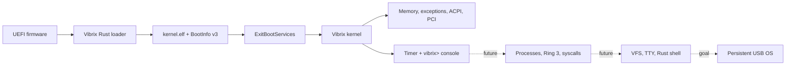

<div align="center">

# ◇ VIBRIX

### A Rust-native operating system designed to live on your USB drive.

**Independent kernel · persistent by design · built by AI agents**

`x86_64` · `UEFI` · `Rust` · `no_std` · `QEMU/OVMF` · `0BSD`

> **How far can vibe coding go?**  
> Our own kernel now boots to a working `vibrix>` development console in QEMU.

[**Website**](https://mixutin.github.io/Vibrix/) · [Verified status](https://mixutin.github.io/Vibrix/status/) · [Roadmap](ROADMAP.md) · [Security roadmap](SECURITY_ROADMAP.md) · [Architecture](docs/ARCHITECTURE.md) · [Dependencies](docs/DEPENDENCIES.md) · [Contributing](CONTRIBUTING.md)

[](https://github.com/mixutin/Vibrix/actions/workflows/ci.yml)
[](https://github.com/mixutin/Vibrix/actions/workflows/dependencies.yml)
[](https://mixutin.github.io/Vibrix/)
[](LICENSE)
[](https://www.rust-lang.org/)
[](ROADMAP.md)

</div>

## What is Vibrix?

Vibrix is an experimental **independent Unix-like operating system** written in Rust, not a Linux distribution or a wrapper around another kernel. Its defining product goal is simple:

> **The removable USB drive is the computer.**

The intended bootloader, kernel, future userspace, applications, settings and home directory travel together on one persistent removable drive. Hardware is rediscovered at boot. Internal NVMe/SATA drives may eventually be optional data devices, never Vibrix system/root installation targets.

**That persistent USB operating system is not available yet.** Today's verified result is an x86-64 QEMU/OVMF kernel and its development console. Native USB storage, mounted persistent root, processes and a userspace shell remain future work.

## Current verified status — 28 September 2026

Source refreshed against main [`5bbcb63`](https://github.com/mixutin/Vibrix/commit/5bbcb635d7a2e67eb626085c84a4ff7072e12ba0), preserving the merged managed-VM, block/NIC/CPU, update-policy, ESP and native PCI-interrupt work. This snapshot describes merged code, not open PR proposals. Consult the [roadmap](ROADMAP.md) for the exact scope of each checkbox.

| Area | Demonstrated scope |
| --- | --- |
| UEFI → standalone kernel | QEMU firmware exit, higher-half kernel and BootInfo v3 |
| CPU/memory foundations | CPUID, GDT/TSS, IDT/fault diagnostics, physical frames, early heap, bounded managed map/protect/reclaim, guarded regions and real CPU fault evidence |
| Discovery / PCI interrupts | ACPI, native PCI/BAR + MCFG/ECAM, driver candidates/binding, CPU inventory, checked MSI/MSI-X programming contracts, and **actual QEMU EDU MSI delivery + disable evidence** |
| Driver binding | Fixed-capacity device-to-driver ownership registry; duplicate, unknown-device and capacity rejection; **not hardware activation** |
| Timer | Native IRQ delivery and a console timer source in QEMU |
| **Interactive kernel console** | **Real virtual keyboard input, bounded editing, dispatch and diagnostic/control commands** |
| GPT tooling | Safe regular-file image creation/inspection; ESP plus dedicated Vibrix System partition |
| VibrixFS tooling | Host wire-format/journal validation, regular-file format/inspect round trips and corruption rejection |
| M5 userspace foundation | Bounded Ring 3/private CR3 and real SYSCALL/SYSRETQ transport are QEMU-verified; a native Rust wrapper crate is merged. General processes and syscall services remain unfinished. |
| Bootstrap VFS | Bounded RAM files, mounted null/zero devices, descriptors and pipes; kernel console access. See [bootstrap VFS](docs/BOOTSTRAP_VFS.md). USB root, file syscalls, TTY and userspace shell remain unfinished. |
| Native USB persistence / Target 001 | Not demonstrated |

### The console is real; it is not userspace

```text
help    clear    info    mem    pci    acpi    uptime    reboot
ls /    cat /welcome    write /tmp/note hello    cat /tmp/note
mkdir /tmp/test    rm /tmp/note    pipe
```

QEMU checks inject real virtual keys, edit `helx` into `help`, inspect diagnostic output and require the development `reboot` path to actually terminate QEMU under `-no-reboot`. The console uses **polled PS/2 input and native COM1 output**; timer IRQ support does not imply an IRQ-driven keyboard. Memory/PCI/ACPI commands expose bounded early snapshots. This is not a framebuffer terminal, USB HID path or hardware-qualified reset implementation.

M4.5's verified development console is a bridge to M5/M6, not a substitute for Ring 3, syscalls, VFS, TTY and the future Rust userspace shell. The bootstrap VFS mounts RAM and null/zero device filesystems in the kernel; it does not persist data. The host VibrixFS tools are still separate from a native persistent root driver.

## Boot path and next steps



The architecture remains Rust-native: a Vibrix-owned UEFI loader and kernel, native subsystem contracts, future Rust drivers/userspace, VibrixFS integration and removable-root provisioning. The bounded single-BSP managed VM now has dynamic mapping, protection, reclaim, guard and CPU-fault evidence; userspace address spaces, SMP shootdowns, operational hardware drivers and persistent system integration remain separate milestones.

See [architecture](docs/ARCHITECTURE.md), [roadmap](ROADMAP.md), [security roadmap](SECURITY_ROADMAP.md) and the [public status page](https://mixutin.github.io/Vibrix/status/). Merged block-device, NIC abstraction, CPU enumeration, managed-VM and isolated QEMU MSI delivery evidence are reflected here; MSI-X delivery, native USB storage, a real network stack and userspace remain unfinished.

## Rust-native, not reinvent-everything-native

**Community crates and external development tools are welcome.** Agents may use crates.io packages, reviewed Git dependencies and properly licensed vendored Rust libraries when they make Vibrix safer, simpler or more maintainable. Dependencies need not use 0BSD themselves; their own licenses and notices remain applicable.

Admission includes research into provenance, maintenance, advisories, transitive features, unsafe code, build scripts/procedural macros, native linkage and actual-target compatibility. Git crates use a full commit revision and an explicitly reviewed repository entry. An unfamiliar source/license needs a scoped policy decision, not a blanket library ban or a global scanner bypass.

The loader must work on `x86_64-unknown-uefi`; the kernel on `x86_64-unknown-none`. Do not silently introduce a host OS, unavailable allocator, `std` or a C runtime into those components. Using a published crate API under its license is permitted; copying another OS's implementation into Vibrix-owned code is not.

Read [dependency policy](docs/DEPENDENCIES.md) and [independence policy](docs/INDEPENDENCE.md).

## CI that checks the inputs as well as the kernel

The workflow now uses a committed Cargo.lock and locked builds, a dated Rust nightly, full RustSec/cargo-deny audits with daily rescans, PR dependency review and minimal-feature checks on both targets. Reports expose licenses, sources, dependency/feature graphs and build-time code indicators. Workflow linting and immutable Action references complement the existing production host tests and real QEMU probes.

Website checks cover local links/fragments, structured data, key metadata and browser-data helpers; PRs do not deploy. Dependency reports are retained for 14 days and the most recent QEMU diagnostics for seven. A passing scanner is not a security guarantee or a whole-system SBOM.

The aggregate `CI gate` and separate `Website checks` are intended as required checks. **Repository branch-protection settings must enforce them; adding workflow YAML alone does not prevent a failing PR from being merged.** See [CI.md](docs/CI.md) for coverage, artifacts and limits.

## Try the development build

Install Git, the Rust toolchain manager, QEMU and OVMF, then:

```bash
git clone https://github.com/mixutin/Vibrix.git
cd Vibrix
./tools/run-qemu.sh
```

For automated smoke testing:

```bash
./tools/test-qemu.sh
```

The build uses the repository-pinned toolchain and Cargo.lock. Follow [QEMU.md](docs/QEMU.md) for exact prerequisites, display/input controls and serial logs. Do not treat this workflow as permission to flash an internal disk or as proof of physical-machine support.

## AI-only engineering, evidence first

AI agents implement, test and document the system while the owner sets direction. Substantive changes require primary-source research, comparison of reasonable approaches, actual test evidence and honest limits. PR titles and descriptions credit the known authoring model; independent review is named only when it happened.

Coordinate through current PRs and repository state, not archived boards. Read [AGENTS.md](AGENTS.md), [coordination](AGENT_COORDINATION.md) and the [AI contribution guide](docs/AI_CONTRIBUTING.md). Synchronize with current main and repair failing checks before integration. A single active agent can integrate a bounded passing change under the standing maintainer policy; that never waives safety or evidence.

**Compiled is not boot-tested. QEMU-tested is not bare-metal tested. Generated code is not a completed feature.**

## License

First-party Vibrix code is available under the **BSD Zero Clause License (0BSD)**; see [LICENSE](LICENSE). External dependencies retain their own licenses and attribution requirements.

<div align="center">

### ◇ VIBRIX

**Small enough to understand. Ambitious enough to become an OS.**

</div>
